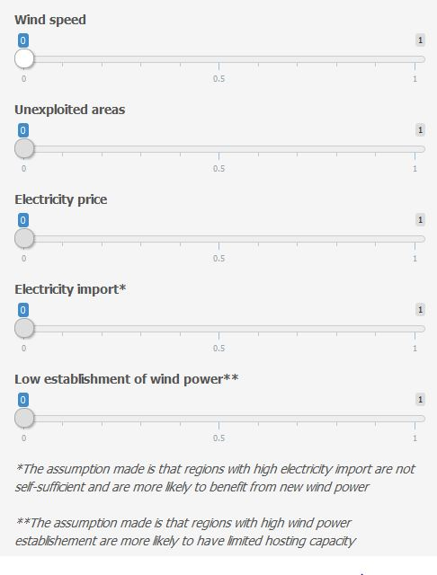
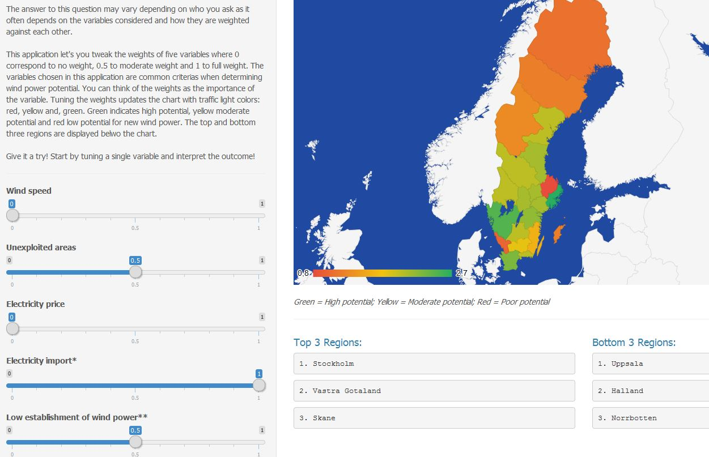
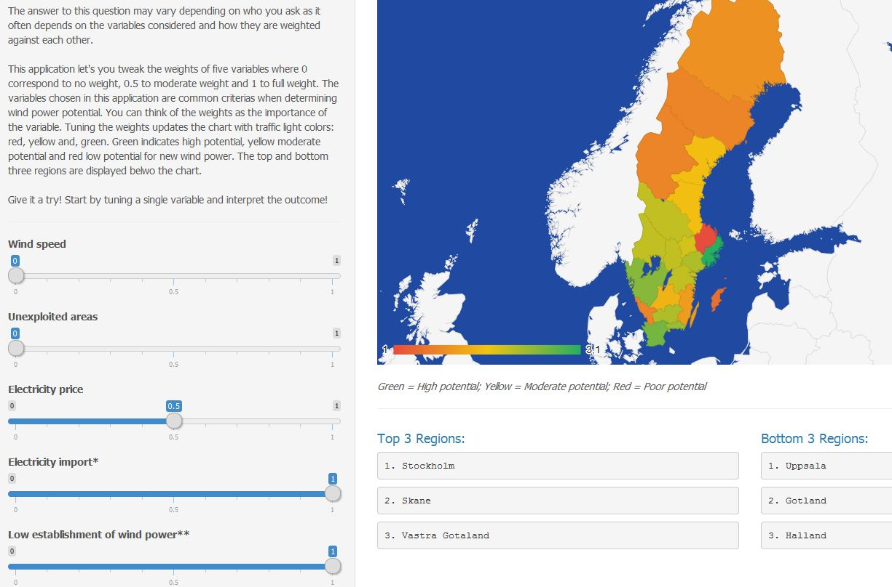
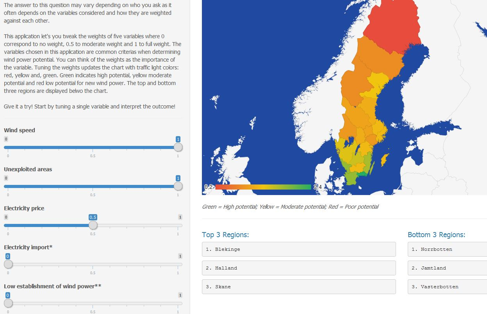

Comparing the Regional Wind Power Potential in Sweden
========================================================
author: Team PoweR, Hack for Sweden 2015
#Date: Sat Mar 14 17:04:14 2015

Daniel Broden, Claes Sandels & Nicolae Doban 

Link to application <https://danbro.shinyapps.io/windapp/>

Motivation
========================================================
- Environmental policies are forcing changes in the energy industry
- The keyword is sustainability
- Wind power is a suitable candidate for Sweden

But where is the potential for new wind power projects in Sweden?

*** 

Determining the potential for wind power with open data
========================================================

***

- Estimating potential per region
- Considering five important variables
- Collecting data from three sources (SMHI, SCB and Nord Pool Spot)
- Processing the data to make them comparable
- Scoring each region according to variable weights

Results from a policy maker perspective
========================================================

Results from a network operator perspective
========================================================

Results from a wind power producer perspective
========================================================

